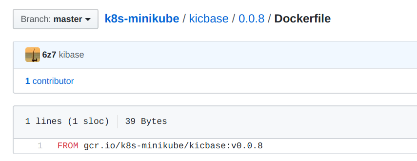
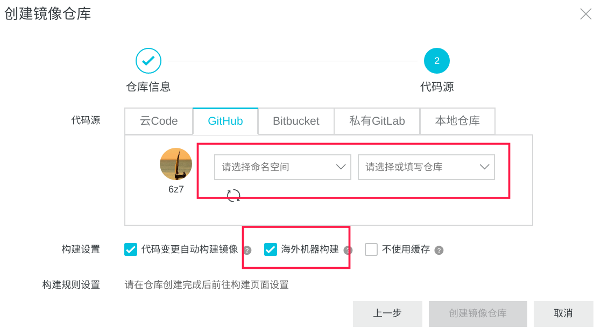
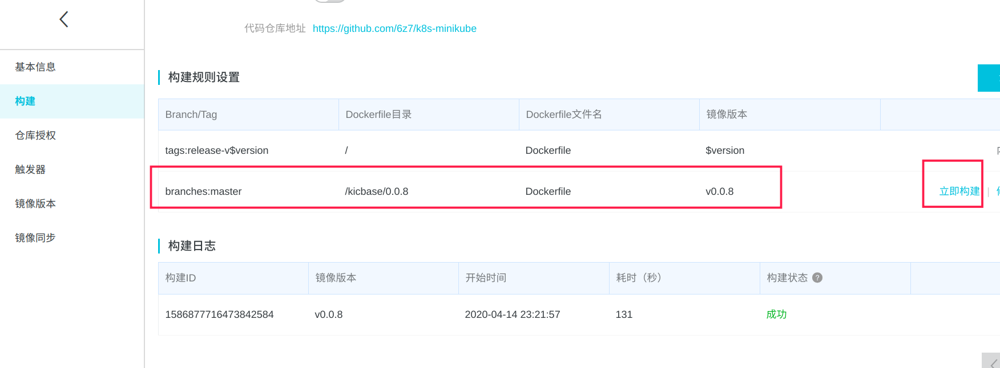
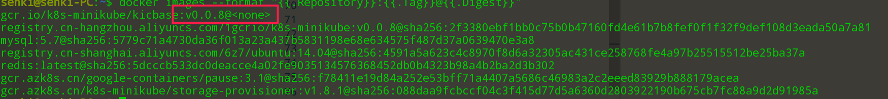
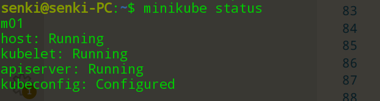

# minikube环境搭建

>本文中使用的minikube版本为minikube-linux-amd64 v1.9.0

minikube的安装步骤请参考官方教程 [install-minikube](https://kubernetes.io/zh/docs/tasks/tools/install-minikube/)。

## 处理启动报错

启动minikube后，即使使用了阿里云的镜像仓库，由于GFW的原因还会出现访问一些域名会报错的情况，如`gcr.io`

使用`--alsologtostderr=true`可以将日志输出打印到控制台

` minikube start --alsologtostderr=true  --image-mirror-country=cn --image-repository=registry.cn-hangzhou.aliyuncs.com/google_containers`

通过错误日志发现主要是：

1.需要下载`https://storage.googleapis.com/minikube-preloaded-volume-tarballs/preloaded-images-k8s-v2-v1.18.0-docker-overlay2-amd64.tar.lz4`

2.需要安装docker镜像`gcr.io/k8s-minikube/kicbase:v0.0.8@sha256:2f3380ebf1bb0c75b0b47160fd4e61b7b8fef0f1f32f9def108d3eada50a7a81`

对于第一个问题手动下载放到`/home/用户名/.minikube/cache/preloaded-tarball/`目录下即可

对于第二个问题有三种处理方式：

1. 配置docker代理

2. 使用三方的gcr.io镜像仓库

3. 自己搭建gcr.io的镜像仓库


docker代理需要在启动时配置
```shell
$ vim /usr/lib/systemd/system/docker.service
[Service]
Environment="ALL_PROXY=socks5://1127.0.0.1:1080"

$ systemctl daemon-reload
$ systemctl restart docker
```
>如果代理比较慢可能下载不下来

使用2和3的方式将镜像下载后需要通过docker tag进行重名为gcr.io命名空间下的镜像.

`docker tag imageid name:tag`

在实际实验中，发现网络上提供的许多三方的gcr.io镜像仓库已经无法使用，遂决定使用阿里云来同步需要的gcr.io下的image

## 阿里云搭建gcr.io镜像仓库

1.首先在github上创建需要同步的镜像的Dockerfile,具体结构可以[参见](https://github.com/6z7/k8s-minikube/blob/master/kicbase/0.0.8/Dockerfile)：



2.阿里云上配置仓库和构建规则




kicbase镜像同步完成后，在本地docker pull下即可

` docker pull registry.cn-hangzhou.aliyuncs.com/k8s-minikube/kicbase:v0.0.8`

## image重命名

`docker tag registry.cn-hangzhou.aliyuncs.com/k8s-minikube/kicbase:v0.0.8 gcr.io/k8s-minikube/kicbase:v0.0.8`

通过docker tag后digest变成了none



minikue使用`docker images --format "{{.Repository}}:{{.Tag}}@{{.Digest}}"`查找镜像后会匹配digest，所以也需要修改下重命名后的digest。

修改`/var/lib/docker/image/overlay2/repositories.json`中的`gcr.io/k8s-minikube/kicbase`，添加一个digest
，重启docker即可生效。
```
守护进程重启
sudo systemctl daemon-reload
重启docker服务
sudo systemctl restart docker
```

## 最后

经过以上步骤希望你也能成功启动minikube 
:grimacing:


